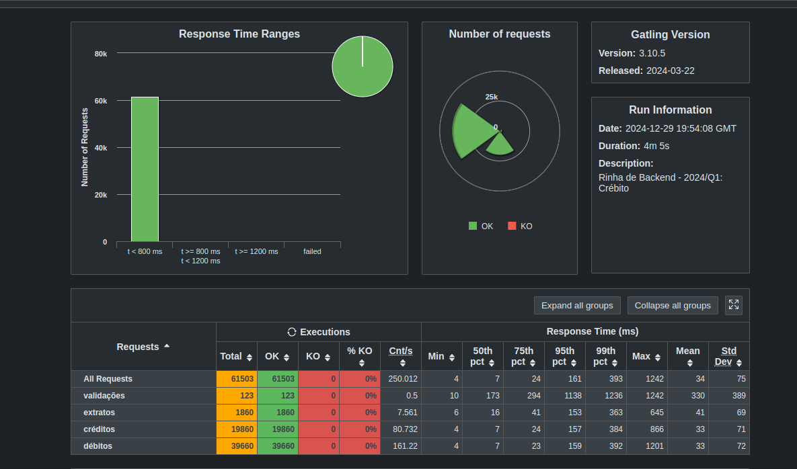

# Crebito (Java version)
A high-performance credit application with support for high concurrency and parallelism.

---
## Introduction
This project is an implementation of the challenge proposed in [Rinha de Backend 2024/Q1](https://github.com/zanfranceschi/rinha-de-backend-2024-q1). It focuses on building a high-performance credit application capable of handling high concurrency and parallelism.

Although this project did not participate in the official competition, tests were made to guarantee it ran according to all specifications and requirements.

---
## Technologies
- `Java 21`: Core language for implementing the application.
- `Spring Boot`: Main Framework, using primarily the following modules: **Web**, **JPA** and **Validation**.
- `PostgreSQL`: Relational database for storing transaction and user data.
- `Docker`: Containerization tool for ensuring consistent runtime environments.
- `nginx`: Reverse proxy server for handling HTTP requests efficiently.

---

## Development & Testing

During development, this project was thoroughly tested using various tools to improve performance and find possible problems. Some notable mentions are:

- [Gatling](https://gatling.io/)
- [Jmeter](https://jmeter.apache.org/)
- [VisualVM](https://visualvm.github.io/)
- [JDK Mission Control](https://www.oracle.com/java/technologies/jdk-mission-control.html)

> The toolset is already set-up in the image `Dockerfile-Local` needing only port configuration.
> 
> Another option is running the compose `docker/docker-compose-local.yml` (already configured). 

---

## Validation 
The application was validated utilizing the simulation provided on the [original repository's load test](https://github.com/zanfranceschi/rinha-de-backend-2024-q1/blob/main/load-test/user-files/simulations/rinhabackend/RinhaBackendCrebitosSimulation.scala). Here are the results:

 
 *The image above shows the results of a Gatling simulation, validating the application's performance under high concurrency, they confirm that the application meets the required performance benchmarks.*